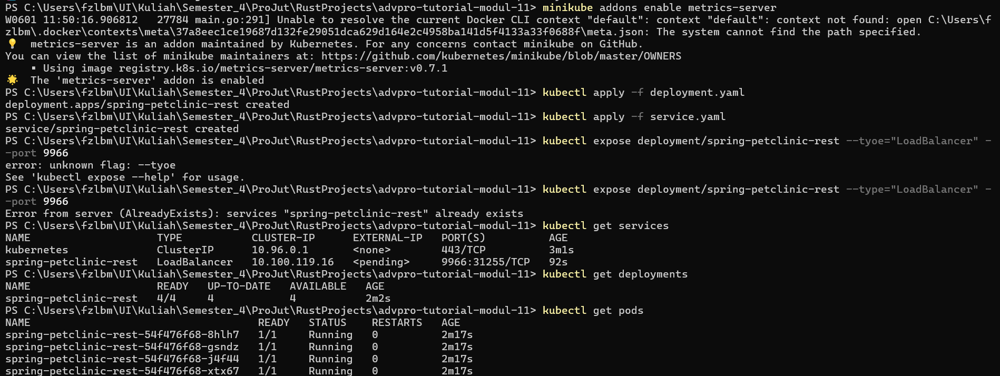

# Tutorial 1 Modul 11

<details>
<summary>Hello Minikube</summary>

1. Bandingkan _log_ aplikasi sebelum dan setelah Anda mengeksposnya sebagai Service. Coba buka aplikasi beberapa kali saat _proxy_ ke Service sedang berjalan. Apa yang Anda lihat di _log_? Apakah jumlah _log_ meningkat setiap kali Anda membuka aplikasi?

    Sebelum mengekspos aplikasi sebagai layanan, kita dapat melihat log yang terkait dengan aplikasi itu sendiri yang berjalan dalam kontainer Docker. Log ini bisa mencakup pesan _startup_, setiap kesalahan atau peringatan yang ditemukan selama eksekusi, dan informasi relevan lainnya yang dihasilkan oleh aplikasi.

    Setelah mengekspos aplikasi sebagai layanan dan mengaksesnya melalui _proxy_ yang berjalan di Minikube menggunakan `kubectl`, log kemungkinan akan menunjukkan aktivitas tambahan terkait komunikasi jaringan dan permintaan yang ditangani oleh layanan. Setiap kali aplikasi dibuka melalui _proxy_, akan ada peningkatan jumlah log yang mencerminkan permintaan masuk, pemrosesan permintaan tersebut oleh layanan, dan setiap respons yang dikirim kembali ke klien.

    Jumlah log akan meningkat setiap kali kita membuka aplikasi, karena setiap interaksi memicu aktivitas log sebagai respons terhadap permintaan masuk dan pemrosesan permintaan tersebut oleh layanan. Peningkatan log ini memberikan indikasi yang jelas tentang aktivitas layanan dan responsivitasnya terhadap permintaan klien.

2. Perhatikan bahwa ada dua versi penggunaan perintah `kubectl get` dalam bagian tutorial ini. Yang pertama tidak memiliki opsi apa pun, sedangkan yang kedua memiliki opsi `-n` dengan nilai yang disetel ke `kube-system`. Apa tujuan dari opsi `-n` dan mengapa _output_ tidak menampilkan _pod_/layanan yang Anda buat secara eksplisit?

    Opsi `-n` dalam `kubectl get` digunakan untuk menentukan _namespace_, letak dari sumber daya akan didaftarkan. _Namespace_ Kubernetes menyediakan cara untuk membagi sumber daya kluster secara logis dan memungkinkan banyak pengguna atau tim untuk berbagi kluster yang sama tanpa saling mengganggu. Ketika tidak ada _namespace_ yang ditentukan, kubectl biasanya otomatis menggunakan _namespace_ _default_.

    Dalam tutorial, panggilan pertama `kubectl get` tidak menyertakan opsi `-n`, jadi itu mencantumkan sumber daya dari _namespace default_ yang mungkin tidak termasuk sumber daya yang kita buat secara eksplisit jika kita membuatnya di _namespace_ yang berbeda.

    Panggilan kedua `kubectl get` menyertakan opsi `-n` dengan nilai yang diatur ke `kube-system` sehingga mencantumkan sumber daya khusus dari _namespace_ `kube-system`. _Namespace_ ini biasanya berisi komponen sistem Kubernetes dan sumber daya terkait infrastruktur.

    Jika kita secara eksplisit membuat _pod_ dan layanan di _namespace_ yang berbeda, kita perlu menentukan _namespace_ tersebut menggunakan opsi `-n` dalam `kubectl get` untuk melihat sumber daya tersebut tercantum dalam _output_. Misalnya:

    ```
    kubectl get pods,services -n <namespace>
    ```

    Ubah `<namespace>` dengan nama yang kita inginkan. Ini akan mendaftarkan _pods_ dan layanan secara spesifik dari _namespace_ tersebut. Jika kita membuat _resources_ pada `default` _namespace_ dan ingin melihatnya, kita bisa menghapus `-n` dari perintah di atas.

</details>

<details>
<summary>Rolling Update Deployment</summary>

1. Rolling Update vs Recreate deployment
    
    * Rolling Update

        Rolling Update melakukan pembaruan bertahap pada _pod_ dalam sebuah _deployment_. Ini secara bertahap menggantikan _pod_ lama dengan yang baru, memastikan tidak ada _downtime_ selama proses pembaruan. Rolling Update men-_deploy_ _pod_ baru secara bertahap sambil secara bertahap menurunkan skala _pod_ lama. Ini memantau kesehatan _pod_ baru sebelum menurunkan skala _pod_ lama, memastikan aplikasi tetap tersedia dan responsif selama pembaruan.

        * Kelebihan

            1. Rolling Update memastikan bahwa aplikasi tetap tersedia bagi pengguna selama proses pembaruan
            2. Pembaruan diterapkan secara bertahap, memungkinkan pemantauan dan validasi _pod_ baru sebelum sepenuhnya beralih ke versi baru.

        * Kekurangan

            1. Rolling Update mungkin memakan waktu lebih lama untuk diselesaikan dibandingkan dengan Recreate, terutama untuk _deployment_ besar, karena pembaruan diterapkan secara bertahap.

    * Recreate

        Recreate hanya menghentikan semua _pod_ yang ada dan membuat yang baru dengan konfigurasi yang diperbarui. Ini secara efektif menghentikan versi lama dari aplikasi dan memulai versi baru secara bersamaan. Recreate menghentikan semua _pod_ yang ada dalam _deployment_ sebelum membuat yang baru dengan konfigurasi yang diperbarui. Ini menghasilkan periode singkat _downtime_ selama proses pembaruan.

        * Kelebihan

            1. Recreate adalah strategi _deployment_ yang sederhana yang menghentikan versi lama dan memulai versi baru, sehingga mudah dipahami dan diterapkan.
            2. Recreate memastikan bahwa aplikasi sepenuhnya diperbarui setelah proses _deployment_ selesai.

        * Kekurangan

            1. Recreate menghasilkan periode singkat _downtime_ selama proses pembaruan, karena semua pod yang ada dihentikan sebelum yang baru dibuat.
            2. Tergantung pada persyaratan aplikasi, _downtime_ selama pembaruan mungkin tidak dapat diterima untuk beberapa pengguna atau aplikasi.

2. _Deploy_ Spring Petclinic REST Menggunakan Strategi Recreate

    1. Ubah tipe strategi _deployment_.

        ```
        '''
        strategy:
            type: Recreate
        '''
        ```

    2. _Delete_ lalu mulai ulang Minikube untuk memastikan _fresh slate_.

        
    
    3. _Apply file manifest_ terbaru.

        

    4. _Set image_ untuk menggunakan versi 3.0.2 dan lakukan _monitoring_.

        

3. Siapkan _file manifest_ lainnya untuk eksekusi _Recreate deployment_.
    
    

4.  Manfaat menggunakan _file manifest_ Kubernetes?

    Penggunaan _file manifest_ Kubernetes membuatnya mudah untuk mengimplementasikan konfigurasi spesifik dengan satu perintah tunggal daripada mengulang semua perintah _deployment_. Hal ini sangat penting dalam lingkungan _deployment_ ketika kita ingin melakukan otomasi proses melalui GitHub Actions atau _pipeline_ CI/CD serupa. _File manifest_ juga dapat berpartisipasi dalam Sistem Kontrol Versi proyek (misalnya: git) yang akan membantu dengan adanya dokumentasi dan _tracing_ perubahan.

</details>